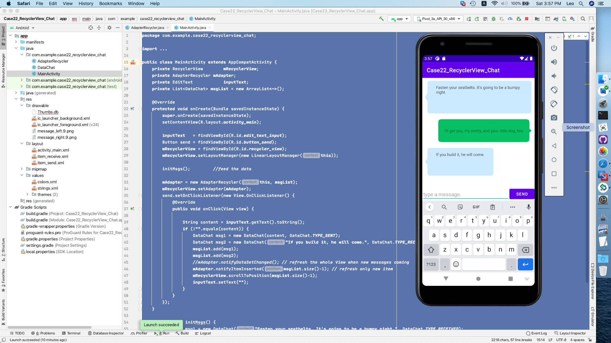

  [](https://github.com/ellerbrock/open-source-badges/)

# Case9Login_Room

Android Room Case

This basic case shows how Room working with Login/Register module.

```java
UserDatabase userDb = UserDatabase.getDatabase(this);
UserDao userDao = userDb.userDao();
		
User u2 = new User(username, password2, email, phonenum);
userDao.add(u2);
userDb.close();
```

Introduction
------------

Room is the way in which one can store and retrieve small amounts of primitive data as key/value pairs to a file on the device storage such as String, int, float, Boolean that make up your preferences in an XML file inside the app on the device storage. 

See the "Case8Login_SharedPreferences" case for a more complete usage and business scenario.

Pre-requisites
--------------

- Android Studio 
- SDK 23

Screenshots
-------------

 

Getting Started
---------------

* Android Studio: Download this case from github and open it directly in Android Studio.
* Other IDE: This case uses the Gradle build system. To build this project, use the "gradlew build" command or use "Import Project".

Support
-------

1. GitHub: https://github.com/hypech/
2. Stack Overflow: https://stackoverflow.com/story/hypech
2. Facebook: 
3. Twitter: https://twitter.com/hypechor
4. Youtube
5. Tiktok
6. http://hypech.github.io
7. http://hypech.com
8. info@hypech.com

If you've found an error in this case, please file an issue on top left of this screen besides <>code.

Patches are encouraged, and may be submitted by forking this project and submitting a pull request through GitHub. 


 <pre>
  Copyright 2021 The Learning Android with Cases Open Source Project

  Licensed under the Apache License, Version 2.0 (the "License");
  you may not use this file except in compliance with the License.
  You may obtain a copy of the License at

      http://www.apache.org/licenses/LICENSE-2.0

  Unless required by applicable law or agreed to in writing, software
  distributed under the License is distributed on an "AS IS" BASIS,
  WITHOUT WARRANTIES OR CONDITIONS OF ANY KIND, either express or implied.
  See the License for the specific language governing permissions and
  limitations under the License.
  
</pre>
